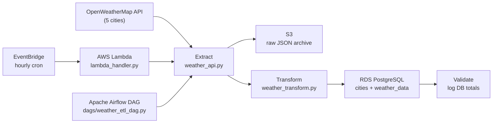

# Weather ETL Pipeline

A production-style data pipeline that fetches live weather data from OpenWeatherMap every hour, archives raw JSON to S3, transforms it, and loads it into a PostgreSQL database — deployed on AWS Lambda with an Apache Airflow DAG for orchestration.

## Architecture



## Tech Stack

| Layer | Technology |
|---|---|
| Language | Python 3.12 |
| Data manipulation | pandas 2.x |
| Database ORM | SQLAlchemy + psycopg2 |
| Cloud storage | AWS S3 (boto3) |
| Database | AWS RDS PostgreSQL 16 |
| Serverless compute | AWS Lambda (Python 3.12 runtime) |
| Scheduler | AWS EventBridge (hourly cron) |
| Orchestration | Apache Airflow 2.10.4 |
| Containerisation | Docker Compose (Airflow UI) |
| Secret management | python-dotenv (.env) |

## Project Structure

```
weather-etl-pipeline/
├── config/
│   └── database.py          # SQLAlchemy engine + connection helpers
├── extractors/
│   └── weather_api.py       # OpenWeatherMap API client
├── transformers/
│   └── weather_transform.py # Flatten JSON, validate schema, fill nulls
├── loaders/
│   ├── database_loader.py   # Upsert into RDS (cities + weather_data)
│   └── s3_loader.py         # Archive raw JSON to S3
├── dags/
│   └── weather_etl_dag.py   # Airflow DAG (5 tasks, XCom data flow)
├── sql/
│   └── create_tables.sql    # DDL: cities dimension + weather_data fact
├── deploy/
│   └── deploy.py            # One-shot Lambda deployment script
├── main.py                  # Pipeline entry point (local / Lambda)
├── lambda_handler.py        # AWS Lambda handler wrapper
├── docker-compose.yaml      # Airflow webserver + scheduler
├── requirements.txt
└── .env.example
```

## Database Schema

```sql
-- Dimension table
cities (city_id SERIAL PK, city_name UNIQUE, country_code, latitude, longitude)

-- Fact table
weather_data (
    city_id FK, recorded_at TIMESTAMPTZ,
    temperature, feels_like, temp_min, temp_max,  -- Kelvin
    pressure, humidity, wind_speed, wind_deg,
    weather_main, weather_description,
    cloudiness, visibility, rain_1h, snow_1h,
    data_fetched_at TIMESTAMPTZ DEFAULT NOW(),
    PRIMARY KEY (city_id, recorded_at)
)
```

## Quickstart (local)

### Prerequisites

- Python 3.10+
- PostgreSQL (local or AWS RDS)
- OpenWeatherMap API key (free tier works)
- AWS credentials with S3 write access

### Setup

```bash
git clone https://github.com/<your-username>/weather-etl-pipeline.git
cd weather-etl-pipeline

python -m venv venv
source venv/Scripts/activate   # Windows
# source venv/bin/activate     # macOS / Linux

pip install -r requirements.txt
```

Copy `.env.example` to `.env` and fill in your values:

```bash
cp .env.example .env
```

```ini
OPENWEATHER_API_KEY=your_api_key_here

# Database
DB_HOST=localhost          # or your RDS endpoint
DB_PORT=5432
DB_NAME=weather_db
DB_USER=postgres
DB_PASSWORD=your_password

# AWS
S3_BUCKET_NAME=your-bucket-name
AWS_ACCESS_KEY_ID=your_key
AWS_SECRET_ACCESS_KEY=your_secret
AWS_REGION=us-east-2

# Cities (comma-separated)
CITIES=New York,London,Tokyo,Mumbai,Hyderabad
```

### Create database tables

```bash
psql -U postgres -d weather_db -f sql/create_tables.sql
```

### Run the pipeline

```bash
python main.py
```

**Sample output:**

```
2026-04-28 01:23:45 [INFO] main: Starting Weather ETL Pipeline
2026-04-28 01:23:45 [INFO] main: Phase 1: Extracting weather data...
2026-04-28 01:23:47 [INFO] weather_api: Fetched weather for New York
2026-04-28 01:23:48 [INFO] weather_api: Fetched weather for London
2026-04-28 01:23:48 [INFO] weather_api: Fetched weather for Tokyo
2026-04-28 01:23:49 [INFO] weather_api: Fetched weather for Mumbai
2026-04-28 01:23:49 [INFO] weather_api: Fetched weather for Hyderabad
2026-04-28 01:23:49 [INFO] main: Extracted 5 records
2026-04-28 01:23:50 [INFO] main: Archived raw data to S3: raw/2026/04/28/batch_20260428_012350.json
2026-04-28 01:23:50 [INFO] main: Phase 2: Transforming data...
2026-04-28 01:23:50 [INFO] main: Transformed 5 records
2026-04-28 01:23:50 [INFO] main: Phase 3: Loading into database...
2026-04-28 01:23:51 [INFO] main: Loaded 5 cities, 5 weather records

Pipeline complete in 5.98s — extracted: 5, transformed: 5, loaded: 5
```

## AWS Deployment

### Prerequisites

- AWS CLI configured (`aws configure`)
- IAM user with permissions: `lambda:*`, `iam:*`, `s3:PutObject/GetObject`
- RDS PostgreSQL instance (publicly accessible or in same VPC as Lambda)
- S3 bucket created

### Deploy Lambda

```bash
cd weather-etl-pipeline
source venv/Scripts/activate
python deploy/deploy.py
```

The script:
1. Installs Linux-compatible wheels (`manylinux2014_x86_64`) into `deploy/lambda_package/`
2. Copies source code into the package
3. Builds `deploy/weather_etl_lambda.zip`
4. Uploads zip to S3 (bypasses the 50 MB direct-upload limit)
5. Creates IAM execution role `weather-etl-lambda-role` (if not present)
6. Creates or updates Lambda function `weather-etl-pipeline`
7. Creates EventBridge rule for hourly execution

**Lambda configuration:**

| Setting | Value |
|---|---|
| Runtime | Python 3.12 |
| Memory | 512 MB |
| Timeout | 300 s |
| Trigger | EventBridge `rate(1 hour)` |
| Region | us-east-2 |

### Test Lambda manually

```bash
aws lambda invoke \
  --function-name weather-etl-pipeline \
  --payload '{}' \
  --cli-binary-format raw-in-base64-out \
  response.json && cat response.json
```

Expected response:

```json
{
  "statusCode": 200,
  "body": "{\"status\": \"success\", \"extracted\": 5, \"transformed\": 5, \"loaded\": 5, \"duration_seconds\": 5.98}"
}
```

## Apache Airflow (DAG)

The DAG `weather_etl` mirrors the Lambda pipeline with 5 discrete tasks, so failures are visible at the task level and retries only re-run the failed step.

```
extract → archive_to_s3 → transform → load → validate
```

| Task | Description |
|---|---|
| `extract` | Calls OpenWeatherMap API for each city; pushes raw JSON via XCom |
| `archive_to_s3` | Saves raw API response to S3 for audit/replay |
| `transform` | Flattens JSON, validates schema, fills nulls; pushes DataFrame as JSON via XCom |
| `load` | Upserts into RDS (`cities` dimension + `weather_data` fact) |
| `validate` | Queries DB totals and logs city count, record count, and date range |

**Schedule:** `@hourly` — starts 2026-04-28, no backfill (`catchup=False`)

**Retries:** 2 retries per task, 5-minute delay between attempts

### Run Airflow locally (Docker)

```bash
# Requires Docker Desktop running
docker compose up -d

# Open the Airflow UI
open http://localhost:8080
# Login: admin / admin

# Trigger a manual run from the UI, or via CLI:
docker compose exec airflow-webserver airflow dags trigger weather_etl

# Stop
docker compose down
```

## Environment Variables Reference

| Variable | Required | Default | Description |
|---|---|---|---|
| `OPENWEATHER_API_KEY` | Yes | — | OpenWeatherMap free-tier API key |
| `DB_HOST` | Yes | — | PostgreSQL host (RDS endpoint or `localhost`) |
| `DB_PORT` | No | `5432` | PostgreSQL port |
| `DB_NAME` | No | `weather_db` | Database name |
| `DB_USER` | No | `postgres` | Database user |
| `DB_PASSWORD` | Yes | — | Database password |
| `S3_BUCKET_NAME` | Yes | — | S3 bucket for raw JSON archives |
| `AWS_ACCESS_KEY_ID` | Yes | — | AWS credentials |
| `AWS_SECRET_ACCESS_KEY` | Yes | — | AWS credentials |
| `AWS_REGION` | No | `us-east-2` | AWS region |
| `CITIES` | No | `New York,London,Tokyo,Mumbai,Hyderabad` | Comma-separated city list |
